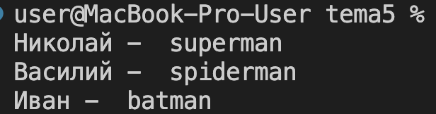
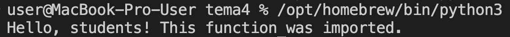
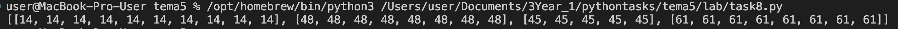
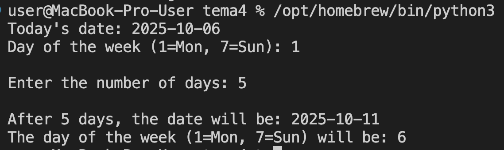
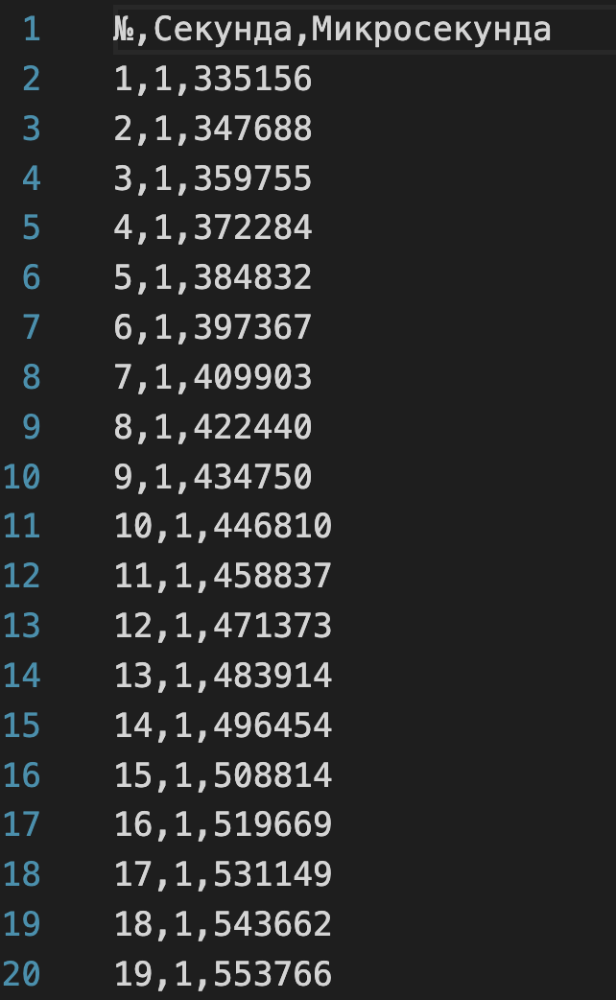
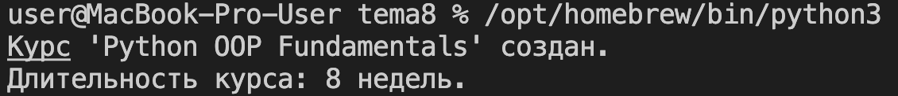
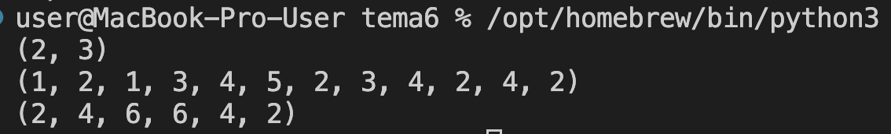
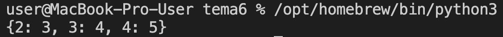
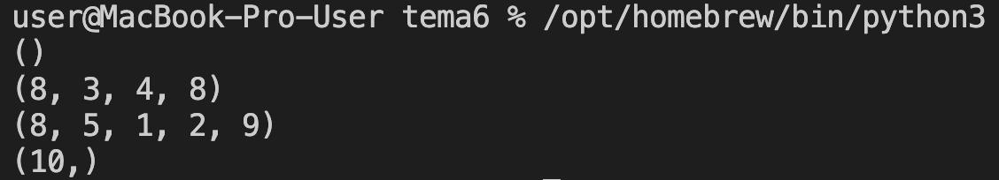
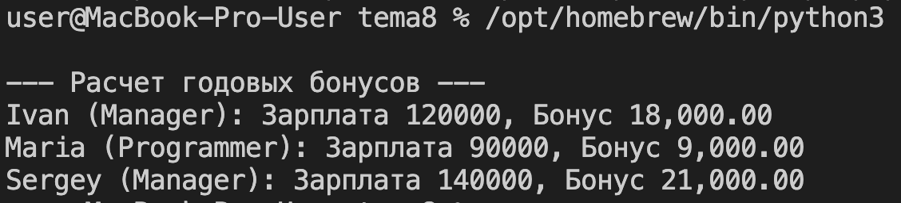

# Тема: Функции и модули

- Студент: талеб мустафа хашим талеб
- Группа: ИВТ-23-1

## Таблица выполнения заданий

| Задание   | Лаб_раб | Сам_раб |
|-----------|:-------:|:-------:|
| Задание 1 |    +    |    +    |
| Задание 2 |    +    |    +    |
| Задание 3 |    +    |    +    |
| Задание 4 |    +    |    +    |
| Задание 5 |    +    |    +    |
| Задание 6 |    +    |         |
| Задание 7 |    +    |         |
| Задание 8 |    +    |         |
| Задание 9 |    +    |         |
| Задание 10|    +    |         |

---

## Лабораторная работа 3

### Задание 1

**Вывод:** Определение Функции и Вывод в Консоль	Продемонстрировано определение базовой функции (def) и запуск через точку входа (if __name__ == '__main__':).

---

### Задание 2

**Вывод:** Возвращаемое Значение (return)	Использован оператор return для передачи вычисленного значения обратно в место вызова, что позволяет хранить и повторно использовать результат.

---

### Задание 3

**Вывод:** Аргументы Функции и Циклы	Показано, как определить функцию, принимающую аргументы, и как многократно вызывать эту функцию внутри цикла for.

---

### Задание 4

**Вывод:** Произвольные Позиционные Аргументы (*args)	Использован синтаксис *args для приема неизвестного количества позиционных аргументов, которые собираются в кортеж (tuple).

---

### Задание 5

**Вывод:** Именованные Аргументы (**kwargs)	Использован синтаксис **kwargs для приема именованных аргументов, которые собираются в словарь (dictionary). Продемонстрирована итерация по этим данным.

---

### Задание 6

**Вывод:** Взаимодействие Функций	Использовано функциональное разложение: одна функция собирает данные (**kwargs), а вторая выполняет расчет (среднее арифметическое).

---

### Задание 7

**Вывод:** Импорт Модулей (from...import)	Продемонстрирован принцип модульного программирования путем написания функции в одном файле и ее импорта из другого.

---

### Задание 8

**Вывод:** Использование Модуля (math)	Показано, как импортировать и использовать специфические математические функции (sqrt, sin, cos) из стандартной библиотеки math.
---

### Задание 9

**Вывод:** Использование Модуля (datetime)	Показано, как использовать datetime и timedelta для работы со временем, в частности, для расчета будущей даты и дня недели.

---

### Задание 10

**Вывод:** Глобальные Переменные (global)	Использовано ключевое слово global внутри функций для явного изменения переменной, определенной вне их области видимости.

---
## Самостоятельная работа 3

### Задание 1

**Вывод:** Комментирование и Замер Времени	Подчеркнута важность детального комментирования кода и использован datetime для замера времени выполнения программы.

---

### Задание 2

**Вывод:** Рекурсия и Случайность (random)	Реализован пример рекурсии, где функция вызывает сама себя при определенных условиях, и использован модуль random для имитации броска кубика.

---

### Задание 3

**Вывод:** Задержка Выполнения (time.sleep)	Продемонстрировано использование функции time.sleep() для принудительной паузы в выполнении программы, что полезно для контроля вывода.

---

### Задание 4

**Вывод:** Произвольное Число Аргументов (*args)	Повторно использован синтаксис *args для сбора неизвестного количества аргументов, что позволило универсально вычислить среднее арифметическое.

---

### Задание 5
 

**Вывод:** Модульное Программирование и Расчеты	Создан двухфайловый проект, обеспечивающий разделение обязанностей: расчет в одном модуле, а взаимодействие с пользователем — в другом.
