# Тема: Операторы, условия, циклы языка Python

- Студент: талеб мустафа хашим талеб
- Группа: ИВТ-23-1

## Таблица выполнения заданий

| Задание   | Лаб_раб | Сам_раб |
|-----------|:-------:|:-------:|
| Задание 1 |    +    |    +    |
| Задание 2 |    +    |    +    |
| Задание 3 |    +    |    +    |
| Задание 4 |    +    |    +    |
| Задание 5 |    +    |         |
| Задание 6 |    +    |         |
| Задание 7 |    +    |         |
| Задание 8 |    +    |         |
| Задание 9 |    +    |         |
| Задание 10|    +    |         |

---

## Лабораторная работа 3

### Задание 1
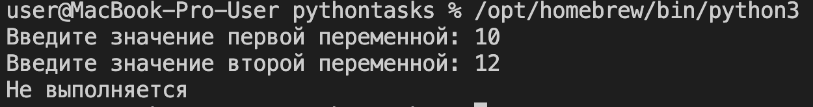

**Вывод:** Реализована конструкция `if/else` для сравнения двух переменных, введенных пользователем, и вывода результата сравнения.

---

### Задание 2
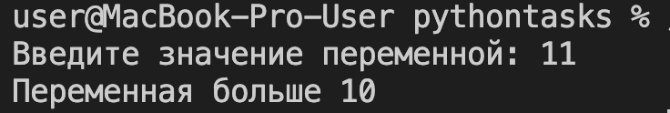

**Вывод:** Использована конструкция `if/elif/else` для определения, к какому из трех диапазонов (меньше 0, от 0 до 10, или больше 10) относится введенное число.

---

### Задание 3
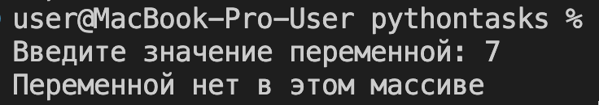

**Вывод:** Проверено наличие введенной переменной в массиве `numbers` с использованием логического оператора **`in`**.

---

### Задание 4
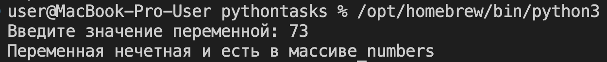

**Вывод:** Применена вложенная условная конструкция (`if` внутри `if/else`) для проверки наличия числа в массиве и его **четности/нечетности**.

---

### Задание 5
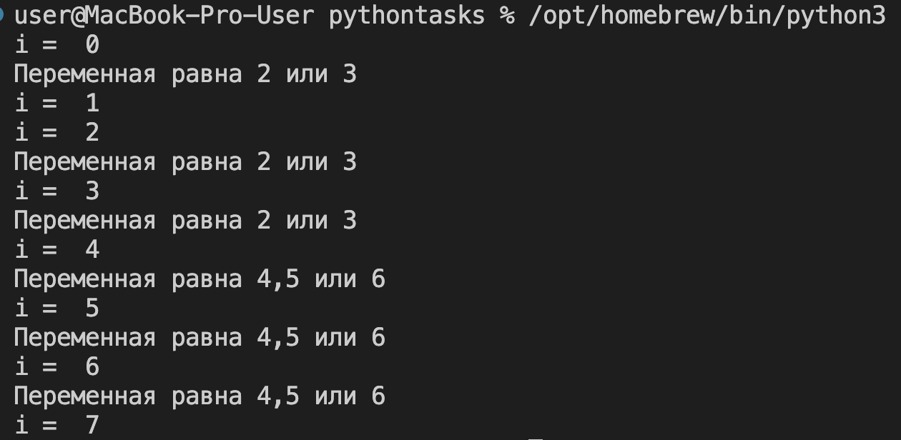

**Вывод:** Продемонстрирована работа цикла **`for`** с использованием операторов **`continue`** (для пропуска итерации) и **`break`** (для досрочного выхода из цикла).

---

### Задание 6
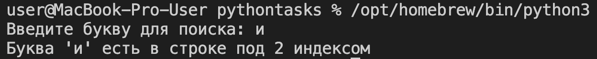

**Вывод:** Использована конструкция **`for...else`** для цикла. Блок **`else`** выполнился только в случае, когда поиск символа завершился без выполнения **`break`**.

---

### Задание 7
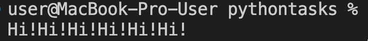

**Вывод:** Реализован обратный цикл **`for`** с помощью `range(start, stop, step)`, чтобы выполнить итерации в обратном порядке (от 10 до 0).

---

### Задание 8
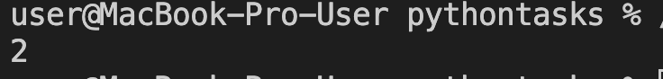

**Вывод:** Использован цикл **`while`** с внутренними условными проверками (`if/elif/else`), обеспечивающими изменение управляющей переменной и корректное завершение цикла.

---

### Задание 9
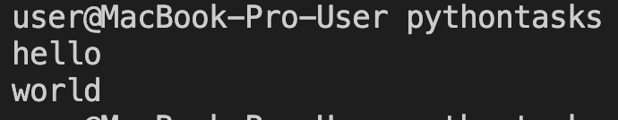

**Вывод:** Созданы **вложенные циклы `for`** с различными переменными-итераторами (`i` и `j`) для выполнения сложной итерации и расчета значения.

---

### Задание 10
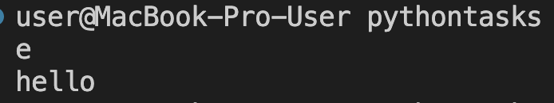

**Вывод:** Проверено наличие нечетного числа в массиве с использованием **булевого флага (`flag`)**. Цикл прерывается сразу после нахождения первого нечетного числа.

---
## Самостоятельная работа 3

### Задание 1
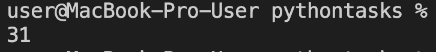

**Вывод:** Число **1** было преобразовано в **31** за две итерации цикла **`for`**, используя только операторы `*=` 5 и `+=` 1.

---

### Задание 2
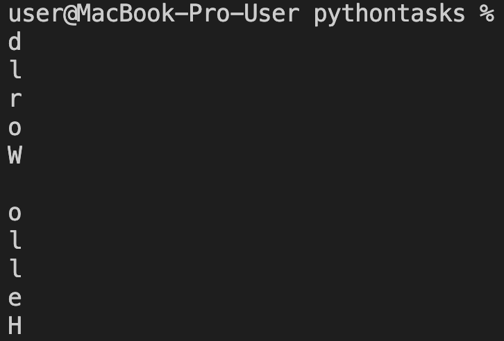

**Вывод:** Фраза "Hello World" была выведена в консоль **посимвольно** в обратном порядке, используя цикл и срезы строк (`[::-1]`), что выполнило задачу не более чем в 3 строки кода.

---

### Задание 3
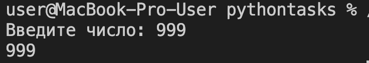

**Вывод:** Введенное число сначала проверено на соответствие диапазону **от 0 до 10**, а затем определено, к какому из трех поддиапазонов оно принадлежит, с помощью **`if/elif/else`**.

---

### Задание 4
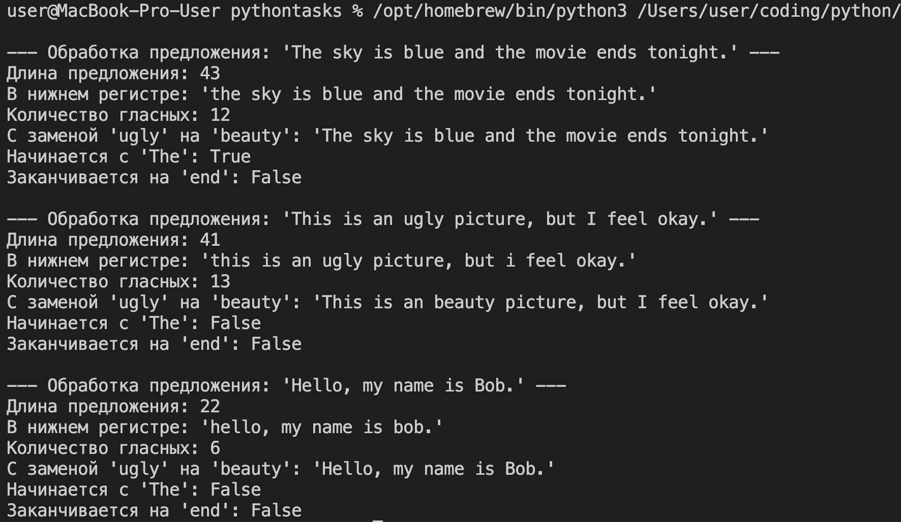

**Вывод:** Выполнены 5 операций манипуляции строкой (длина, регистр, подсчет гласных, замена, проверка начала/конца) для проверки различных строковых методов языка Python.

---

### Задание 5
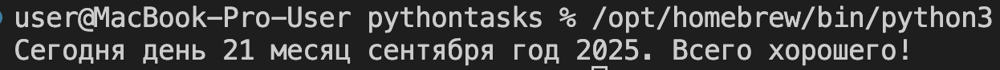 

**Вывод:** Собрана программа из фрагментов кода, которая успешно сгенерировала повторяющийся вывод "hello" и "hello world" с помощью цикла **`while`**, работающего 4 раза.
