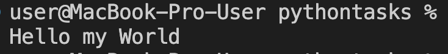
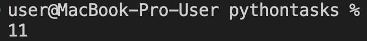
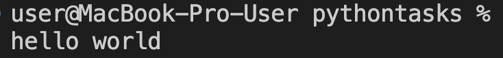
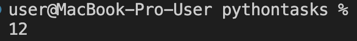
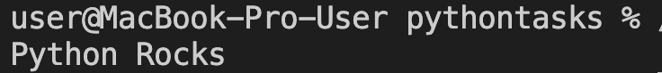

# Тема: Базовые операции языка Python

**Студент:** талеб мустафа хашим талеб 
**Группа:** ИВТ-23-1

## Таблица выполнения заданий

| Задание   | Лаб_раб | Сам_раб |
|-----------|:-------:|:-------:|
| Задание 1 |    +    |    +    |
| Задание 2 |    +    |    +    |
| Задание 3 |    +    |    +    |
| Задание 4 |    +    |    +    |
| Задание 5 |    +    |    +    |
| Задание 6 |    +    |    +    |
| Задание 7 |    +    |    +    |
| Задание 8 |    +    |    +    |
| Задание 9 |    +    |    +    |
| Задание 10|    +    |    +    |

## Самостоятельная работа 2

### Задание 1
**Скриншот результата:**  
  

**Вывод:** Получил False без использования слова `False`.

---

### Задание 2
**Скриншот результата:**  
  

**Вывод:** Присвоил значения трём переменным и вывел их в консоль за две строки.

---

### Задание 3
**Скриншот результата:**  
  

**Вывод:** Реализовал ввод только целых чисел через `int(input())`.

---

### Задание 4
**Скриншот результата:**  
  

**Вывод:** Создал строку ≤ 5 символов и получил строку длиной ≥ 16 символов.

---

### Задание 5
**Скриншот результата:**  
  

**Вывод:** Вывел дату в формате "Сегодня день месяц год. Всего хорошего!" с помощью f-строки.

---

### Задание 6
**Скриншот результата:**  
  

**Вывод:** Вставил "my" в строку "Hello World" между словами.

---

### Задание 7
**Скриншот результата:**  
  

**Вывод:** Определил длину строки "Hello World".

---

### Задание 8
**Скриншот результата:**  
  

**Вывод:** Преобразовал строку "HELLO WORLD" в нижний регистр.

---

### Задание 9
**Скриншот результата:**  
  

**Вывод:** Решил задачу с числами (например, вычислил квадрат числа).

---

### Задание 10
**Скриншот результата:**  
  

**Вывод:** Решил задачу со строками (например, подсчитал количество букв "а" в строке).
