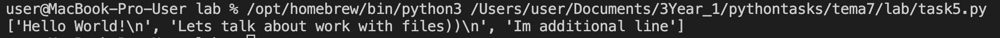
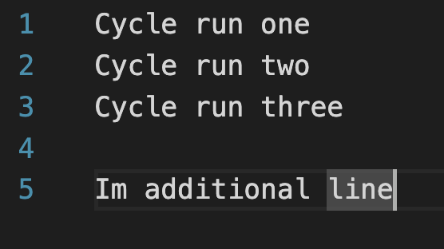
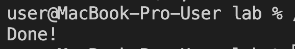
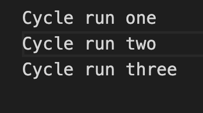

# Тема: Работа с файлами (ввод, вывод)

- Студент: талеб мустафа хашим талеб
- Группа: ИВТ-23-1

## Таблица выполнения заданий

| Задание   | Лаб_раб | Сам_раб |
|-----------|:-------:|:-------:|
| Задание 1 |    +    |    +    |
| Задание 2 |    +    |    +    |
| Задание 3 |    +    |    +    |
| Задание 4 |    +    |    +    |
| Задание 5 |    +    |    +    |
| Задание 6 |    +    |    -    |
| Задание 7 |    +    |    -    |
| Задание 8 |    +    |    -    |
| Задание 9 |    +    |    -    |
| Задание 10 |    +    |    -    |

---

## Лабораторная работа 7

### Задание 1: 

**Вывод:** Продемонстрированы базовые операции чтения с явным управлением ресурсами (open()/close()). Выполнен вывод первой строки (readline()) и всех строк в виде списка (readlines()).

---

### Задание 2: 

**Вывод:** Продемонстрированы базовые операции чтения с явным управлением ресурсами (open()/close()). Выполнен вывод первой строки (readline()) и всех строк в виде списка (readlines()).

---

### Задание 3:

**Вывод:** Продемонстрированы базовые операции чтения с явным управлением ресурсами (open()/close()). Выполнен вывод первой строки (readline()) и всех строк в виде списка (readlines()).

---

### Задание 4: 

**Вывод:** Использована контекстная конструкция with open() для безопасной работы. Показаны два способа вывода: получение всех строк списком (readlines()) и идиоматичное построчное чтение через итерацию.

---

### Задание 5: 

**Вывод:** Использована контекстная конструкция with open() для безопасной работы. Показаны два способа вывода: получение всех строк списком (readlines()) и идиоматичное построчное чтение через итерацию.

---

### Задание 6: 

**Вывод:** Использованы режимы добавления ('a') для записи новой строки и последующий режим чтения ('r') для проверки обновленного содержимого файла.

---

### Задание 7: 

**Вывод:** Продемонстрирована полная перезапись содержимого файла с использованием режима записи ('w'), что стирает старые данные и заменяет их новыми.

---

### Задание 8: 

**Вывод:** Использован модуль os и функция os.walk() для рекурсивного обхода файловой системы, структурированно выводя пути к папкам, поддиректориям и файлам.

---

### Задание 9: 

**Вывод:** Реализована функция, которая считывает текст, находит максимальную длину слова, используя max(..., key=len), и возвращает либо одно самое длинное слово, либо список слов с одинаковой длиной.

---

### Задание 10: 

**Вывод:** Создан файл rows_300.csv с использованием модуля csv. Записаны 300 строк, содержащих временные метки (секунды и микросекунды), с искусственной задержкой для демонстрации различий.

---
## Самостоятельная работа 7

### Задание 1:

**Вывод:** Для анализа частоты слов применен класс collections.Counter. Текст предварительно очищен от пунктуации (translate) и приведен к нижнему регистру, что обеспечивает точный подсчет общей частоты и определение самого частого слова.

---

### Задание 2: 

**Вывод:** Разработана интерактивная программа-трекер, использующая файл expenses.txt в качестве базы данных. Реализованы функции для добавления ('a') новых расходов и просмотра ('r') всех записей.

---

### Задание 3: 

**Вывод:** Выполнен подсчет трех метрик: числа строк, числа слов (путем очистки и split()) и числа латинских букв (фильтрация символов в диапазоне 'a'-'z').

---

### Задание 4: 

**Вывод:** Использован модуль re (регулярные выражения) для регистронезависимой замены. Метод re.compile(..., re.IGNORECASE).sub() корректно заменяет запрещенное слово на астериски.

---

### Задание 5:

**Вывод:** Программа обрабатывает файл grades.txt для вычисления среднего балла каждого студента. Путем итерации и сравнения найдено и выведено имя студента с наивысшим средним баллом.
