# Тема: Работа с Git

**Студент:** талеб мустафа хашим талеб
**Группа:** ИВТ-23-1

## Таблица выполнения заданий

| № задания | Выполнение |
|-----------|------------|
| задание 1 | + |
| задание 2 | - |
| задание 3 | - |
| задание 4 | - |
| задание 5 | - |
| задание 6 | - |
| задание 7 | - |
| задание 8 | - |
| задание 9 | - |
| задание 10 | - |

## Задание : Установка

**Скриншот результата:**
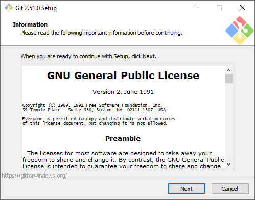
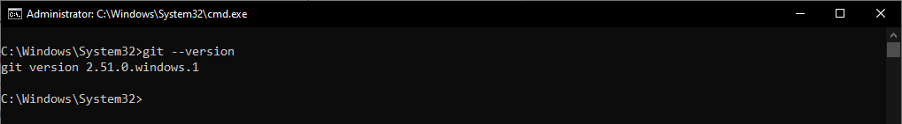

**Вывод:** Установил Git на компьютер.

## Задание 2.2: Настройка

**Скриншот результата:**
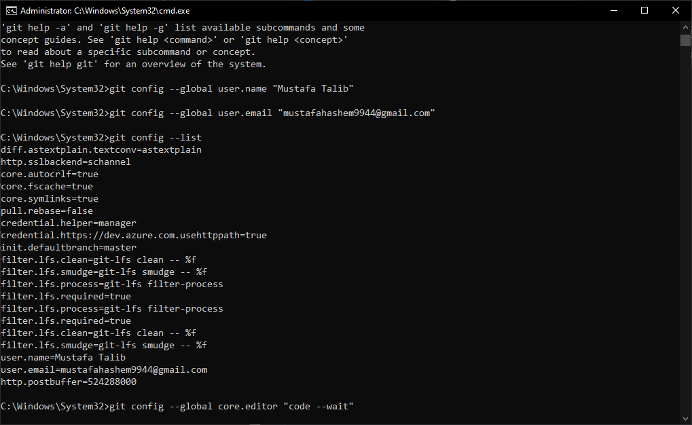

**Вывод:** Настроил глобальные параметры Git - имя пользователя и email, которые будут использоваться в коммитах.
## Задание 2.3: 
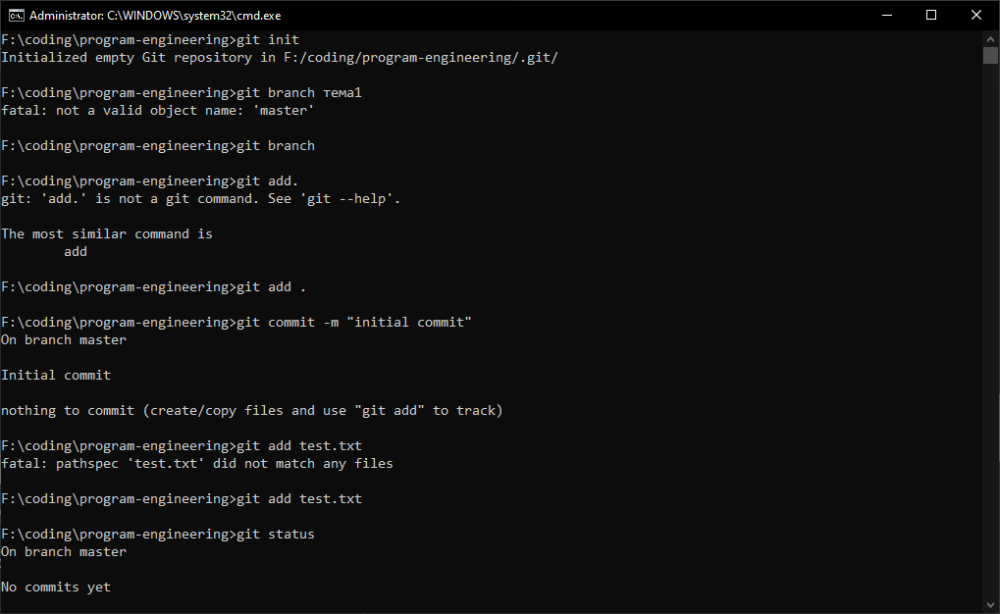
## Задание 2.5:
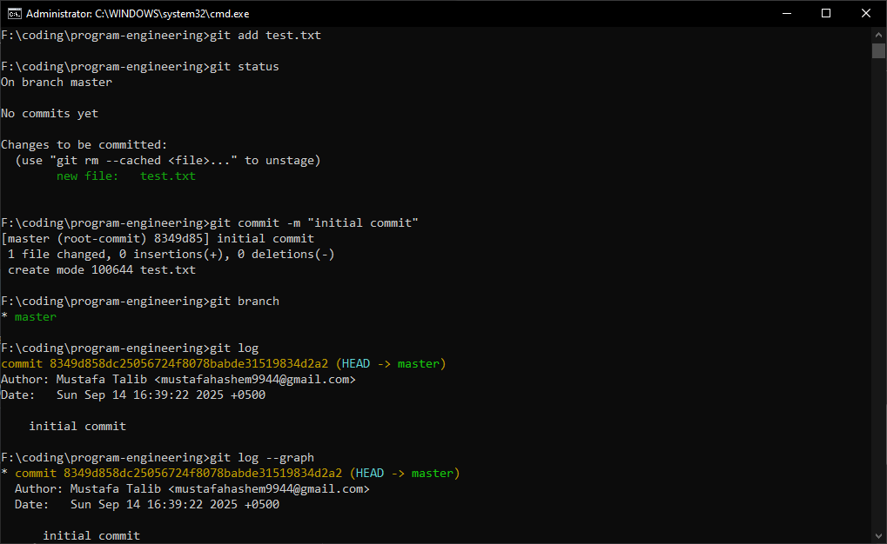
## Задание 2.6:
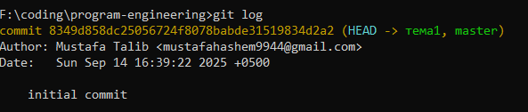
## Задание 2.7
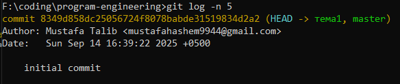
## Задание 2.8
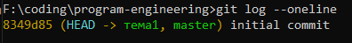
## Задание 2.9
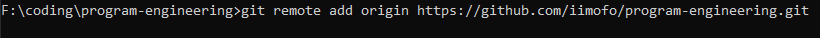
## Задание 2.10
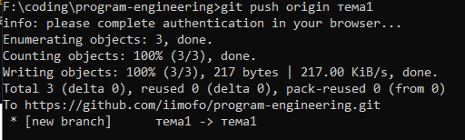
## Задание 2.11
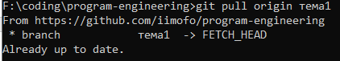
## Задание 2.12
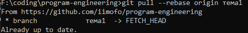

