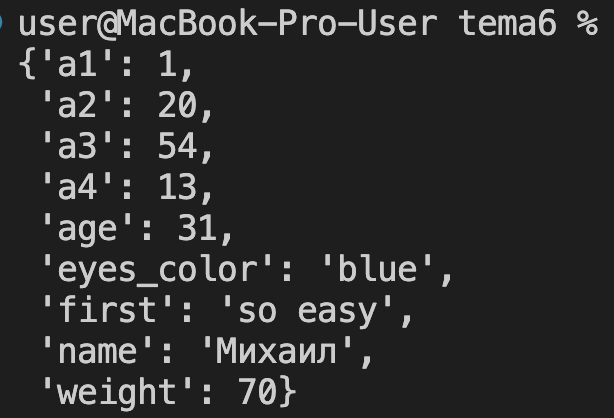
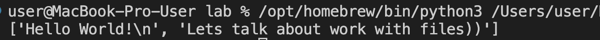
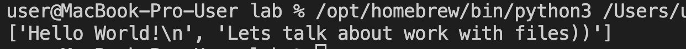
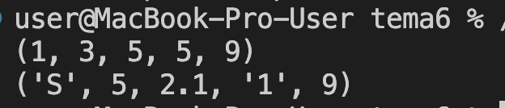

# Тема: Базовые коллекции: словари, кортежи

- Студент: талеб мустафа хашим талеб
- Группа: ИВТ-23-1

## Таблица выполнения заданий

| Задание   | Лаб_раб | Сам_раб |
|-----------|:-------:|:-------:|
| Задание 1 |    +    |    +    |
| Задание 2 |    +    |    +    |
| Задание 3 |    +    |    +    |
| Задание 4 |    +    |    +    |
| Задание 5 |    +    |    +    |

---

## Лабораторная работа 6

### Задание 1: Доступ по номеру кабинета (Словари)

**Вывод:** Использован **словарь** (`dict`) для хранения данных доступа к кабинетам. Продемонстрирована замена громоздких конструкций `if/elif/else` на эффективный поиск по ключу. Если ключ отсутствует, код корректно возвращает предопределенные значения "None" и "False".

---

### Задание 2: Обновление словаря (**kwargs)

**Вывод:** Создана функция `dict_maker`, принимающая неограниченное количество именованных аргументов (**`**kwargs`**) и использующая метод **`.update()`** для добавления их в существующий словарь. Применен модуль `pprint` для форматированного вывода словаря.

---

### Задание 3: Строка в кортеж и список

**Вывод:** Показано, как **строка** может быть автоматически разложена на отдельные символы с помощью конструкторов **`tuple()`** и **`list()`**. Это позволяет получить поэлементное представление строки, аналогичное `split()`.

---

### Задание 4: Распаковка кортежа в аргументы функции

**Вывод:** Создана функция `personal_info` для вывода данных. При вызове функции использован оператор **распаковки кортежа** (**`*`**), который передает элементы кортежа как отдельные позиционные аргументы.

---

### Задание 5: Условная сортировка кортежа

**Вывод:** Реализована функция `tuple_sort`, которая проверяет тип всех элементов кортежа с помощью **`isinstance(elm, int)`**. Если все элементы являются целыми числами, кортеж сортируется; в противном случае возвращается исходный кортеж, что демонстрирует обработку неизменяемых типов данных.

---
## Самостоятельная работа 6

### Задание 1: Разделение пользовательского ввода

**Вывод:** Получен ввод от пользователя, разделенный пробелом. Использован метод **`.split()`** для создания **списка** (`list`) из строк, а затем конструктор **`tuple()`** для преобразования этого списка в **кортеж**.

---

### Задание 2: Удаление первого вхождения из кортежа

**Вывод:** Создана функция для обхода **неизменяемости кортежей**. Кортеж временно преобразуется в **список**, где с помощью **`.index()`** и **`.pop()`** удаляется первое вхождение элемента. Затем список преобразуется обратно в кортеж.

---

### Задание 3: Словарь 3-х самых частых цифр

**Вывод:** Использован класс **`collections.Counter`** для быстрого подсчета частоты элементов. Получены три самых частых элемента, которые затем преобразованы в **словарь**, отсортированный по возрастанию ключа (цифры).

---

### Задание 4: Извлечение подкортежа по ID

**Вывод:** Реализована логика отслеживания ID с использованием **кортежа** и метода **`.index()`**. Код ищет первое и второе вхождение целевого ID и использует **срез** для извлечения подкортежа, а также обрабатывает случаи, когда ID отсутствует или встречается только один раз.

---

### Задание 5: Собственная задача: Ранжирование сотрудников (Кортеж и Список)

**Вывод:** Создана функция для ранжирования, где **кортеж** используется для хранения неизменяемого списка имен. Оценки вместе с именами собираются в **список кортежей**, который затем сортируется по значению оценки (`key=lambda item: item[1]`) для получения финального рейтинга.
